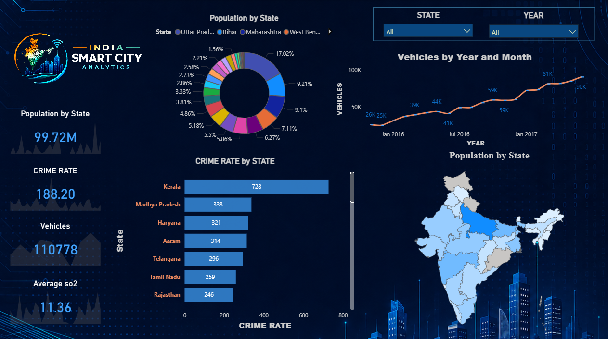
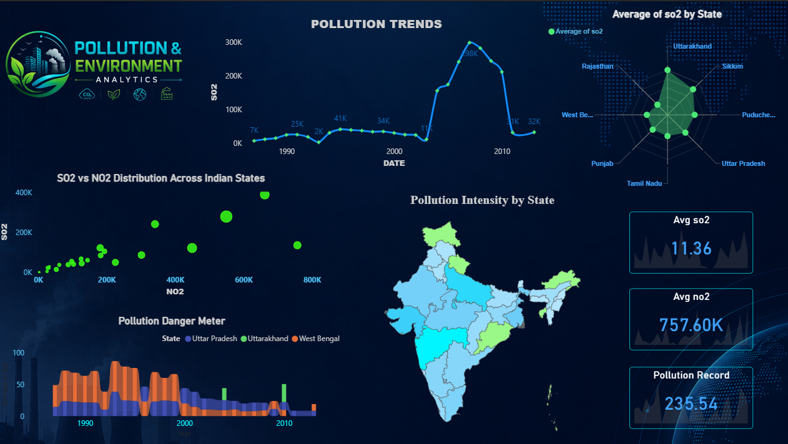
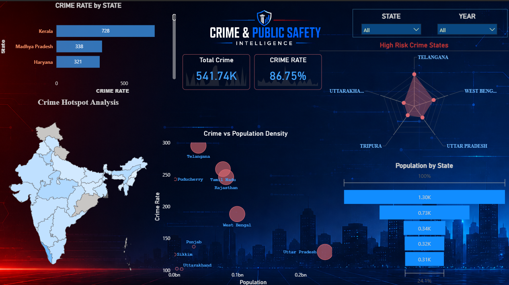
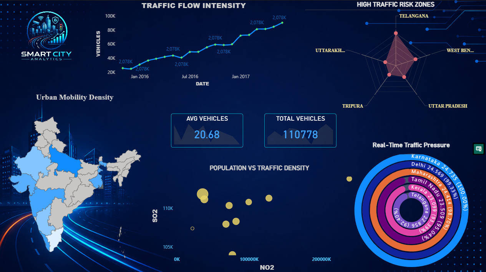

# 🌆 Smart City Dashboard

<div align="center">

### 🚦 Interactive Power BI Dashboard for Smart City Analytics

Analyzing Crime, Traffic, Air Quality, and Population Insights using Power BI.

</div>

---

# 📌 Project Overview

The Smart City Dashboard is an interactive business intelligence project built using Power BI.  
This dashboard helps analyze urban city data including:

- 🚔 Crime Analysis
- 🌫 Air Quality Monitoring
- 🚗 Traffic Insights
- 👥 Population Statistics

The dashboard provides interactive visualizations, KPI tracking, and map-based insights for smarter city analysis.

---

# 💡 Why This Project Matters

This project demonstrates how data analytics and business intelligence can help improve smart city management using real-world insights.

The dashboard helps in:

- 🚔 Understanding crime patterns and identifying high-risk areas
- 🚗 Monitoring traffic conditions and congestion trends
- 🌫 Tracking air quality levels across regions
- 👥 Analyzing population distribution for urban planning
- 📊 Supporting data-driven decision making

This project showcases practical skills in:
- Data Cleaning & Transformation
- Dashboard Design
- Data Visualization
- Interactive Reporting
- Business Intelligence
- Problem Solving using Data

---

# 🎯 Career & Portfolio Value

This project was built to demonstrate industry-level Power BI and data analytics skills for:

- Data Analyst roles
- Business Intelligence positions
- Power BI Developer opportunities
- Internship applications
- Portfolio & Resume projects

The dashboard reflects the ability to work with:
- Multiple datasets
- Real-world analytics scenarios
- Interactive dashboard development
- Professional UI/UX design in Power BI

---

# 🚀 Features

✅ Executive Overview Dashboard  
✅ Crime Analytics  
✅ Traffic Analysis  
✅ Air Quality Monitoring  
✅ Interactive Filters & Slicers  
✅ Dynamic KPI Cards  
✅ India JSON Map Integration  
✅ Professional Dashboard UI Design  

---

# 🛠 Tools & Technologies

| Tool | Purpose |
|------|----------|
| Power BI | Dashboard Development |
| Power Query | Data Cleaning & Transformation |
| DAX | Data Calculations |
| JSON Map | India Shape Visualization |
| CSV / Excel | Data Sources |

---

# 📂 Project Structure

```bash
Smart-City-Dashboard
│
├── PowerBI_Dashboard
├── Dataset
├── Assets
│   ├── Logos
│   ├── Wallpapers
│   └── IndiaShape.json
│
├── Screenshots
└── README.md
```

---

# 📸 Dashboard Screenshots

## 🏠 Executive Overview



---

## 🌫 Air Quality Analysis



---

## 🚔 Crime Analysis



---

## 🚗 Traffic Analysis



---

# 📊 Key Insights

- Identified high crime regions
- Analyzed traffic congestion trends
- Monitored air quality variations
- Compared state-wise population statistics
- Created interactive smart city analytics system

---

# 🎯 Future Improvements

- Real-time API Integration
- Predictive Analytics
- AI-based Forecasting
- Live Traffic Monitoring
- Smart Alerts System

---

# 👨‍💻 Author

## Aditya Singh

Power BI Developer | Data Analytics Enthusiast

---

# ⭐ If you like this project, give it a star on GitHub!
